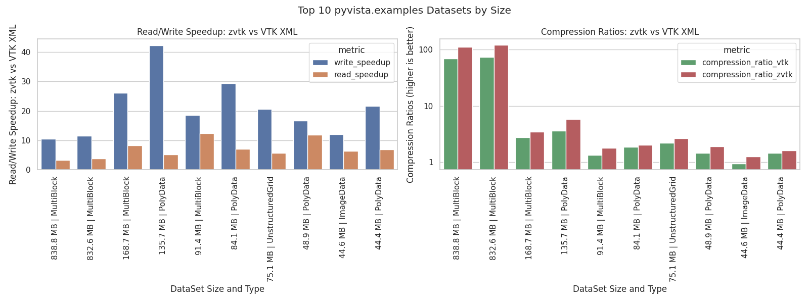
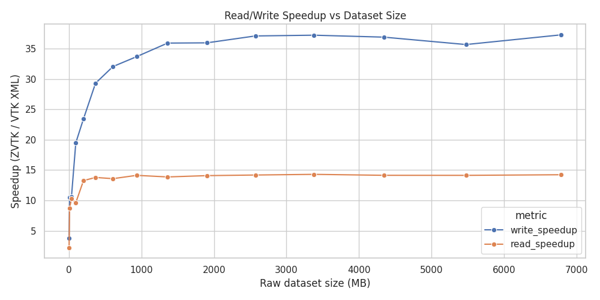
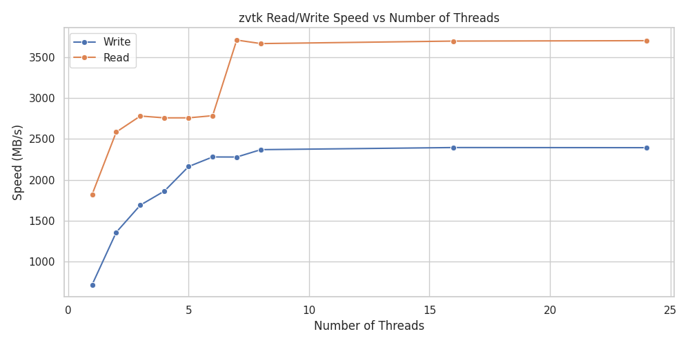
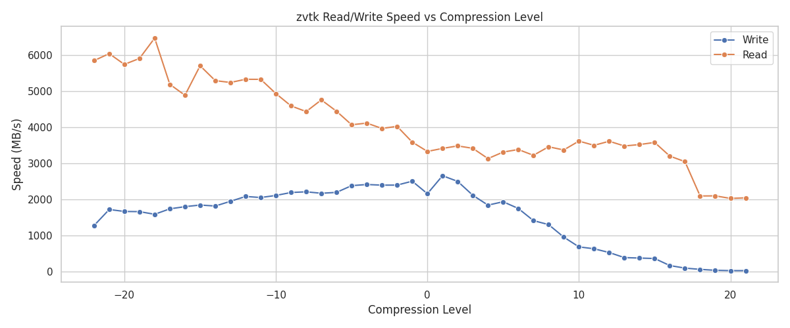
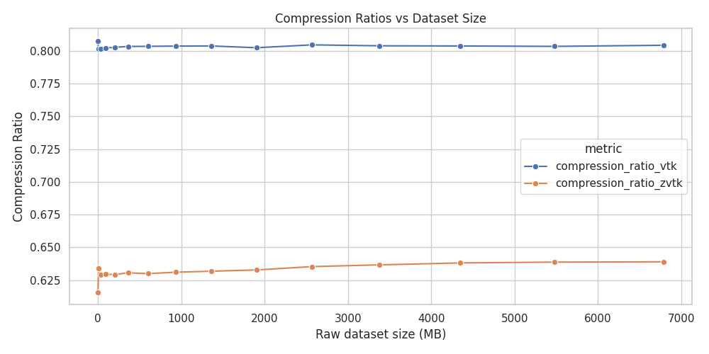

# zvtk - Seamlessly Compress VTK Datasets using Zstandard

**tl;dr** Read in VTK datasets 37x faster, write 14x faster, all while using 28% less space vs. VTK's modern XML format.



### Usage

Compatible with all VTK dataset types. Uses [PyVista](https://docs.pyvista.org/) under the hood.

```py
import zvtk

# create and write out
ds = pv.Sphere()
zvtk.write(ds, "dataset.zvtk")

# read in and show these are identical
ds_in = zvtk.read("dataset.zvtk")
assert ds == ds_in
```

**Alternative VTK example**

```py
import vtk
import zvtk

# create dataset using VTK source
sphere_source = vtk.vtkSphereSource()
sphere_source.SetRadius(1.0)
sphere_source.SetThetaResolution(32)
sphere_source.SetPhiResolution(32)
sphere_source.Update()

vtk_ds = sphere_source.GetOutput()

# read back
zvtk.write(vtk_ds, "sphere.zvtk")
ds_in = zvtk.read("sphere.zvtk")

```

### Rational

VTK's XML writer is flexible and supports [most datasets](https://docs.vtk.org/en/latest/vtk_file_formats/vtkxml_file_format.html), but its compression is limited to a single thread, has only a subset of compression algorithms, and the XML format adds significant overhead.

To demonstrate this, the following example writes out a single file without compression. This example requires `pyvista>=0.47.0` for the `compression` parameter.

<details>
<summary>Dataset Creation</summary>

```py
import time
from pathlib import Path
import numpy as np
import pyvista as pv
tmp_dir = Path("/tmp/zvtk_test")
tmp_dir.mkdir(exist_ok=True)

rng = np.random.default_rng(42)
results = []

# Generate a single unstructured grid
n_dim = 200
imdata = pv.ImageData(dimensions=(n_dim, n_dim, n_dim))
ugrid = imdata.to_tetrahedra()

ugrid["pdata"] = rng.random(ugrid.n_points)
ugrid["cdata"] = rng.random(ugrid.n_cells)

nbytes = (
    ugrid.points.nbytes
    + ugrid.cell_connectivity.nbytes
    + ugrid.offset.nbytes
    + ugrid.celltypes.nbytes
    + ugrid["pdata"].nbytes
    + ugrid["cdata"].nbytes
)
print(f"Size in memory: {nbytes / 1024**2:.2f} MB")
print()
```

</details>

```py
>>> print(f"Size in memory: {nbytes / 1024**2:.2f} MB")

Size in memory: 1993.89 MB
```

```py
Save using VTK XML format

>>> tmp_path = Path("/tmp/ds.vtu")
>>> tstart = time.time()
>>> ugrid.save(tmp_path, compression=None)
>>> print(f"Written without compression in {time.time() - tstart:.2f} seconds")
>>> nbytes_disk = tmp_path.stat().st_size
>>> print(f"  File size:            {nbytes_disk / 1024**2:.2f} MB")
>>> print(f"  Compression Ratio:    {nbytes / nbytes_disk}")
>>> print()

Written without compression in 7.93 seconds
File size:            2858.94 MB
Compression Ratio:    0.6974239255525742
```

This amounts to around a 43% overhead using VTK's XML writer. Using the default
compression we can get the file size down to 791 MB, but it takes 19 seconds to
compress.

```py
>>> tstart = time.time()
>>> ugrid.save(tmp_path, compression='zlib')  # default
>>> print(f"Compressed in {time.time() - tstart:.2f} seconds")
>>> nbytes_disk = tmp_path.stat().st_size
>>> print(f"  File size:            {nbytes_disk / 1024**2:.2f} MB")
>>> print(f"  Compression Ratio:    {nbytes / nbytes_disk}")
>>> print()

Compressed in 18.83 seconds
File size:            791.05 MB
Compression Ratio:    2.5205590295735663
```

Clearly there's room for improvement here as this amounts to a compression rate
of 105.89 MB/s.

### VTK Compression with Zstandard: zvtk

This library, `zvtk`, writes out VTK datasets with minimal overhead and uses
[Zstandard](https://github.com/facebook/zstd) for compression. Moreover, it's
been implemented with multi-threading support for both read and write
operations.

Let's compress that file again but this time using `zvtk`:

```py
>>> import zvtk
>>> tmp_path = Path("/tmp/ds.zvtk")
>>> tstart = time.time()
>>> zvtk.write(ugrid, tmp_path)
>>> print(f"Compressed zvtk in {time.time() - tstart:.2f} seconds")
>>> nbytes_disk = tmp_path.stat().st_size
>>> print(f"  File size:            {nbytes_disk / 1024**2:.2f} MB")
>>> print(f"  Compression Ratio:    {nbytes / nbytes_disk}")

Compressed zvtk in 0.92 seconds
Threads:              -1
File size:            660.41 MB
Compression Ratio:    3.019175309922273
```

This gives us a write performance of 2167 MB/s using the default number of
threads and compression level, resulting in a 20x speedup in write performance
versus VTK's XML writer. This speedup is most noticeable for larger files:



Even when disabling multi-threading we can still achieve excellent performance:

```py
>>> tstart = time.time()
>>> zvtk.write(ugrid, tmp_path, n_threads=0)
>>> print(f"Compressed zvtk in {time.time() - tstart:.2f} seconds")
>>> nbytes_disk = tmp_path.stat().st_size
>>> print(f"  File size:            {nbytes_disk / 1024**2:.2f} MB")
>>> print(f"  Compression Ratio:    {nbytes / nbytes_disk}")

Compressed zvtk in 2.91 seconds
Threads:              0
File size:            660.47 MB
Compression Ratio:    3.0188911592355683
```

This amounts to a single-core compression rate of 685.18 MB/s, which is in agreement with Zstandard's [benchmarks](https://github.com/facebook/zstd#benchmarks).

Note that the benefit of threading drops off rapidly past 8 threads, though part of this is due to the performance vs. efficiency cores of the CPU used for benchmarking (see below).



---

Reading in the dataset is also fast. Comparing with VTK's XML reader using defaults:

```py
Read VTK XML

>>> print(f"Read VTK XML:")
>>> timeit pv.read("/tmp/ds.vtu")

6.22 s ± 9.21 ms per loop (mean ± std. dev. of 7 runs, 1 loop each)

Read zstd

>>> print(f"Read zstd:")
>>> timeit zvtk.read("/tmp/ds.zvtk")

563 ms ± 7.96 ms per loop (mean ± std. dev. of 7 runs, 1 loop each)
```

This is an 11x speedup for this dataset versus VTK's XML, and it's still fast
even with multi-threading disabled:

```py
>>> timeit zvtk.read("/tmp/ds.zvtk", n_threads=0)
1.11 s ± 4.51 ms per loop (mean ± std. dev. of 7 runs, 1 loop each)
```

This amounts to 1796 MB/s for a single core, which is also in agreement with Zstandard's [benchmarks](https://github.com/facebook/zstd#benchmarks).

Additionally, you can control Zstandard's compression level by setting `level=`. A quick benchmark for this dataset indicates the defaults give a reasonable performance vs. size tradeoff:



Note that both `zvtk` and VTK's XML default compression give relatively constant compression ratios for this dataset across varying file sizes:



These benchmarks were performed on an `i9-14900KF` running the Linux kernel
`6.12.41` using `zstandard==0.24.0` from PyPI. Storage was a 2TB Samsung 990
Pro without LUKS mounted at `/tmp`.

### Additional Information

The `benchmarks/` directory contains additional benchmarks using many datasets, including all applicable datasets in `pyvista.examples` (see [PyVista Dataset Gallery](https://docs.pyvista.org/api/examples/dataset_gallery#dataset-gallery)).
