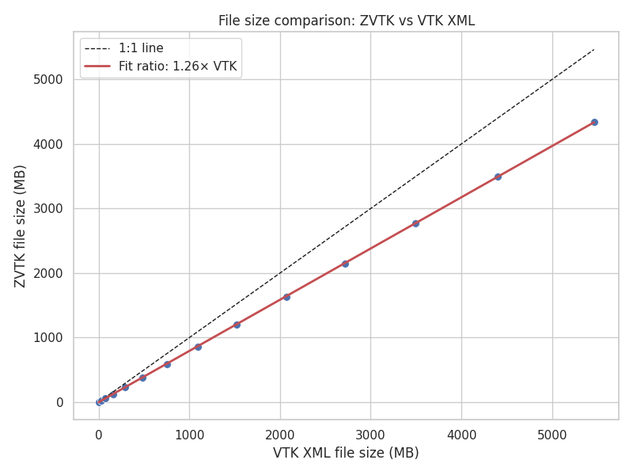
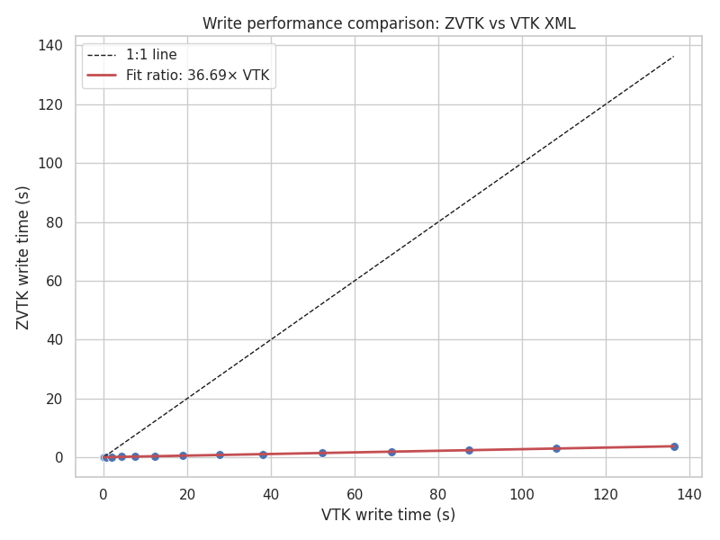
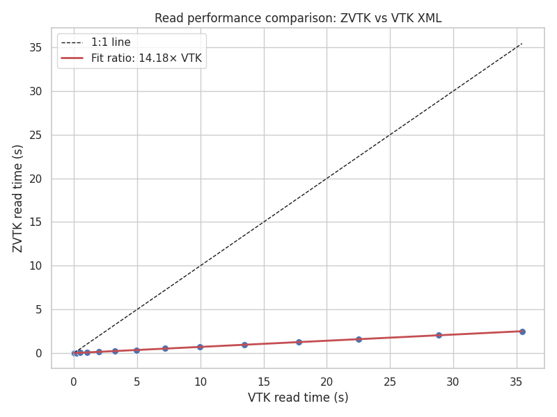

Synthetic Dataset Benchmarks
============================

These benchmarks evaluate ``zvtk`` performance on synthetic
:class:`pyvista.UnstructuredGrid`s generated from
:class:`pyvista.ImageData`. Dataset sizes range from a handful of KB to over 5
GB.

File Size Comparison
--------------------

   File size comparison for synthetic unstructured grids

``zvtk`` consistently produces smaller files than VTK XML.  The red line indicates
the linear fit ratio between ``zvtk`` and VTK file sizes, showing a 26% reduction
in file size for ``zvtk`` files vs. VTK XML using zlib (default).

Write Time Comparison
---------------------

   Write time comparison for synthetic unstructured grids

``zvtk`` write times are consistently lower than VTK XML, about 37 times faster
for this dataset.

Read Time Comparison
--------------------

   Read time comparison for synthetic unstructured grids

Reading ``zvtk`` files is substantially faster than VTK XML across all dataset
sizes, about 14 times faster than VTK.

Speedup vs Dataset Size
-----------------------

.. figure:: figures/synthetic-fig3.png
   :alt: Read/Write speedup vs dataset size
   :align: center

   Read/Write speedup (zvtk / VTK XML) versus dataset size

Both read and write operations achieve multiple-fold speedups with ``zvtk``.
Larger datasets show the most pronounced improvements.

Compression Ratios vs Dataset Size
----------------------------------

.. figure:: figures/synthetic-fig4.png
   :alt: Compression ratios vs dataset size
   :align: center

   Compression ratios (zvtk vs VTK XML) versus dataset size

ZVTK maintains higher compression than VTK XML for all synthetic dataset sizes.

Benchmark Script
----------------

The benchmarks were executed using the following Python script:

.. literalinclude:: ../../benchmarks/benchmark-synthetic.py
   :language: python
